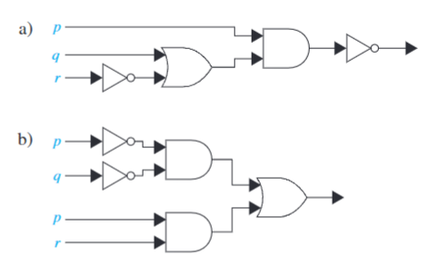

# HW2
## Exercise 1.2
### 6
6.You can upgrade your operating system if and only if you have a 32-bit processor running at 1GHz or faster, at least 1GB of memory, and 16GB of available hard disk space, or a 64-bit processor running at 2GHz or faster, at least 2GB of memory, and at least 32GB of available hard disk space. Express your answer using the following propositions:

$u$: "You can upgrade your operating system"
$b_{32}$: "You have a 32-bit processor"
$b_{64}$: "You have a 64-bit processor" 
$g_1$: "Your processor runs at 1GHz or faster"
$g_2$: "Your processor runs at 2GHz or faster"
$r_1$: "Your processor has at least 1GB of memory"
$r_2$: "Your processor has at least 2GB of memory"
$h_{16}$: "You have at least 16GB of available hard disk space"
$h_{32}$: "You have at least 32GB of available hard disk space"

### answer

$ {(b_{32} \land g_1 \land r_1 \land h_{16}) \lor (b_{64} \land g_2 \land r_2 \land h_{32})} \implies u$ 

---
### 8

8.Express these system specifications using the proposi-
tions 
$p$: "The user enters a valid password," 
$q$: "Access
is granted,"
$r$: "The user has paid the subscription fee" 
and logical connectives (including negations).
a) "The user has paid the subscription fee, but does not
enter a valid password."
b) "Access is granted whenever the user has paid the
subscription fee and enters a valid password."
c) "Access is denied if the user has not paid the subscrip-
tion fee."
d) "If the user has not entered a valid password but has
paid the subscription fee, then access is granted."

### answer

- a) $r \land \neg p$
- b) $(r \land p) \implies q$
- c) $\neg r \implies q$
- d) $(r \land \neg p) \implies q$
---

10.Are these system specifications consistent? "Whenever
the system software is being upgraded, users cannot ac-
cess the file system. If users can access the file system,
then they can save new files. If users cannot save new
files, then the system software is not being upgraded."

### answer
we assume that
- $p$: system software is being upgraded.
- $q$: user can access the file system.
- $r$: user can save new files.

we know that:
- $ p \implies q $
- $ q \implies r $
- $ r \implies \neg p $

then:
- $ ((p \implies q) \land (q \implies r) \land (r \implies \neg p)) \implies ( p \implies \neg p)$

then:
$ \neg p \land p$
then:
the system is not consistent.

---
### 14

14.What Boolean search would you use to look for Web
pages about hiking in West Virginia? What if you wanted
to find Web pages about hiking in Virginia, but not in
West Virginia?

### answer

- HIKING AND WEST VIRGINIA
- HIKING AND VIRGINIA AND NOT WEST VIRGINIA

---

### 21

21.When three professors are seated in a restaurant, the host-
ess asks them: "Does everyone want coffee?" The first
professor says "I do not know." The second professor then
says "I do not know." Finally, the third professor says
"No, not everyone wants coffee." The hostess comes back
and gives coffee to the professors who want it. How did
she figure out who wanted coffee?

### answer

- we assume that $p_i$ is the $i$ professor wants the coffee. $u$ is everyone want coffee.
- $((\neg p_1 \lor \neg p_2 \lor \neg p_3) \implies \neg u)$
- $(p_1 \land p_2 \land p_3) \implies u$
- For the first professor, if $p_1$ is false, then he will know that $u$ is not true, but he don't know, so $p_1$ is true.
- For the second professor, he knows $p_1$ is true.  if $p_2$ is false, then he will know that $u$ is not true, but he don't know, so $p_2$ is true.
- For the last professor, he knows $p_1$ and $p_2$ is true. Then the two proposition will be:
    - $\neg p_3 \implies \neg u$
    - $p_3 \implies u$
- So $ p_3 \iff u$
- Because $u$ is false, $p_3$ is false.
- so the first and second want coffee, the last professor doesn't want coffee.

37.Steve would like to determine the relative salaries of three
coworkers using two facts. 
- First, he knows that if Fred is not the highest paid of the three, then Janice is. 
- Second, he knows that if Janice is not the lowest paid, then
Maggie is paid the most. 

Is it possible to determine the relative salaries of Fred, Maggie, and Janice from what Steve knows? If so, who is paid the most and who the least? Explain your reasoning.

### answer
- we assume that 
    - $p_1$ : Fred is the highest paid one.
    - $p_2$ : Janice is the highest paid one.
    - $p_3$ : Maggie is the highest paid one.
    - $q_1$ : Fred is the lowest paid one.
    - $q_2$ : Janice is the lowest paid one.
    - $q_3$ : Maggie is the lowest paid one.
- we know that
    - $axiom_1$ : $\neg p_1 \implies p_2$
    - $axiom_2$ : $\neg q_2 \implies p_3$
    - $axiom_3$ : $\neg(p_1 \land q_1) \land \neg(p_2 \land q_2) \land \neg(p_3 \land q_3)$
    - $axiom_4$ : $(p_1 \lor p_2 \lor p_3) \land \neg(p_1 \land p_2) \land \neg(p_2 \land p_3) \land \neg(p_1 \land p_3)$
    - $axiom_5$ : $(q_1 \lor q_2 \lor q_3) \land \neg(q_1 \land q_2) \land \neg(q_2 \land q_3) \land \neg(q_1 \land q_3)$

- From $axiom_1$ , we know that: $ p_1 \lor p_2$  ($collary_1$)
- From $axiom_2$ , we know that: $ q_2 \lor p_3$  ($collary_2$)
- From $axiom_3$ , we know that: $ \neg (p_2 \land q_2) $  ($collary_3$)

Case1: $p_2$ is true.
then from $collary_3$, $q_2$ is false.
then from $collary_2$, $p_3$ is true.
then from $axiom_4$, $p_1$ and $p_2$ are false.
We can't know who is the least paid one.

Case2: $q_2$ is true.
then from $collary_3$, $p_2$ is false.
then from $collary_2$, $p_1$ is true.
then from $axiom_4$ and $axiom_5$, $p_2$ $p_3$ $q_1$ $q_3$ are false.
Done.

Case3: $q_2$ and $p_2$ are both false.
then from $collary_1$ and $collary_2$, $p_1$ and $p_3$ are true.
violate the $axiom_4$

45.Find the output of each of these combinatorial circuits.

- a)
$\neg(p \land (q \lor \neg r))$

- b)
$(\neg p \land \neg q) \lor (p \land r)$
## Exercises 1.3

4.Use truth tables to verify the associative laws
a) $(p \lor q) \lor r \equiv p \lor (q \lor r)$.
b) $(p \land q) \land r \equiv p \land (q \land r)$

### answer
- a)

| $p$ | $q$ | $p \lor q$ | $r$ | $(p \lor q) \lor r$|
|-----|-----|------------|-----|--------------------|
| T | T | T | T | T |
| T | F | T | T | T |
| F | T | T | T | T |
| F | F | F | T | T |
| T | T | T | F | T |
| T | F | T | F | T |
| F | T | T | F | T |
| F | F | F | F | F |

| $p$ | $q$ | $r$ | $q \lor r$ | $p \lor (q \lor r)$|
|-----|-----|------------|-----|--------------------|
| T | T | T | T | T |
| T | F | T | T | T |
| F | T | T | T | T |
| F | F | T | T | T |
| T | T | F | T | T |
| T | F | F | F | T |
| F | T | F | T | T |
| F | F | F | F | F |

- b)

| $p$ | $q$ | $p \land q$ | $r$ | $(p \land q) \land r$|
|-----|-----|-------------|-----|--------------------|
| T | T | T | T | T |
| T | F | F | T | F |
| F | T | F | T | F |
| F | F | F | T | F |
| T | T | T | F | F |
| T | F | F | F | F |
| F | T | F | F | F |
| F | F | F | F | F |

| $p$ | $q$ | $r$ | $q \land r$ | $p \land (q \land r)$|
|-----|-----|-----|-------------|---------------------|
| T | T | T | T | T |
| T | F | T | F | F |
| F | T | T | T | F |
| F | F | T | F | F |
| T | T | F | F | F |
| T | F | F | F | F |
| F | T | F | F | F |
| F | F | F | F | F |

12.Show that each of these conditional statements is a tautology by using truth tables.
a) $[\neg p \land (p \lor q)] \implies q$
b) $[(p \implies q) \land (q \implies r)] \implies (p \implies r)$
c) $[p \land (p \implies q)] \implies q$
d) $[(p \lor q) \land (p \implies r) \land (q \implies r)] \implies r$

- a)

| $p$ | $q$ | $\neg p$ | $p \lor q$ | $[\neg p \land (p \lor q)] \implies q$ |
|-----|-----|----------|------------|----------------------------------------|

24.Show that $\neg(p \oplus q)$ and $p \iff q$ are logically equivalent

28.Show that $(p \implies q) \lor (p \implies r)$ and $p \implies (q \lor r)$ are logically equivalent.

31.Show that $p \leftrightarrow q$ and $(p \implies q) \land (q \implies p)$ are logically equivalent.

36.Show that $(p \land q) \implies r$ and $(p \implies r) \land (q \implies r)$ are not logically equivalent.

38.Find the dual of each of these compound propositions.
a) $p \lor \neg q$ b) $p \land (q \lor (r \land T))$
c) $(p \land \neg q) \lor (q \land F)$

66.Determine whether each of these compound propositions
is satisfiable.
a) $(p \lor q \lor \neg r) \land (p \lor \neg q \lor \neg s) \land (p \lor \neg r \lor \neg s) \land
(\neg p \lor \neg q \lor \neg s) \land (p \lor q \lor \neg s)$
b) $(\neg p \lor \neg q \lor r) \land (\neg p \lor q \lor \neg s) \land (p \lor \neg q \lor \neg s) \land
(\neg p \lor \neg r \lor \neg s) \land (p \lor q \lor \neg r) \land (p \lor \neg r \lor \neg s)$
c) $(p \lor q \lor r) \land (p \lor \neg q \lor \neg s) \land (q \lor \neg r \lor s) \land (\neg p \lor
r \lor s) \land (\neg p \lor q \lor \neg s) \land (p \lor \neg q \lor \neg r) \land (\neg p \lor
\neg q \lor s) \land (\neg p \lor \neg r \lor \neg s)$

71.Explain the steps in the construction of the com-
pound proposition given in the text that asserts that
every column of a 9 × 9 Sudoku puzzle contains
every number.