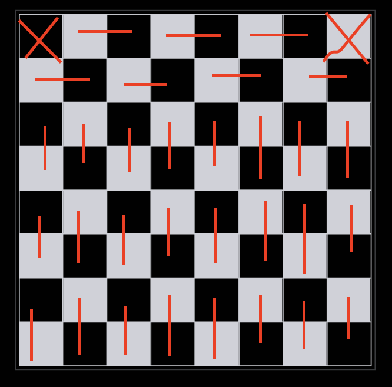

## Exercise 1.6
### 9

9. For each of these collections of premises, what relevant conclusion or conclusions can be drawn? Explain the rules of inference used to obtain each conclusion from the premises. 
- a) "If I take the day off, it either rains or snows." "I took Tuesday off or I took Thursday off." "It was sunny on Tuesday." "It did not snow on Thursday." 
- b) "If I eat spicy foods, then I have strange dreams." "I have strange dreams if there is thunder while I sleep." "I did not have strange dreams." 
- c) "I am either clever or lucky." "I am not lucky." "If I am lucky, then I will win the lottery." 
- d) "Every computer science major has a personal computer." "Ralph does not have a personal computer." "Ann has a personal computer." 
- e) "What is good for corporations is good for the United States." "What is good for the United States is good for you." "What is good for corporations is for you to buy lots of stuff." 
- f ) "All rodents gnaw their food." "Mice are rodents." "Rabbits do not gnaw their food." "Bats are not rodents."

### answer

- a) 
let $P(x)$ be the statment that I take $x$ off. $S(x)$ be the statement that $x$ snows, $R(x)$ be the statement that $x$ rains.
we know that:
$$
\begin{align}
\forall x(P(x) \implies (S(x) \lor R(x))) \\
P(Tuesday) \lor P(Thursday) \\
\lnot S(Tuesday) \land \lnot R(Tuesday) \\
\lnot S(Thursday)
\end{align}
$$

$$
(P(Tuesday) \lor P(Thursday)) \land \forall x(P(x) \implies S(x) n\lor 
 R(x)) \implies S(Tuesday) \lor R(Tuesday) \lor S(Thursday) \lor R(Thursday) \quad \text{I don't know} \\
 (S(Tuesday) \lor R(Tuesday) \lor S(Thursday) \lor R(Thursday)) \land (\lnot S(Tuesday) \land \lnot R(Tuesday)) \implies R(Thursday) \lor S(Thursday) \quad \text{Disjunctive syllogism} \\
(R(Thursday) \lor S(Thursday)) \land \lnot S(Thursday) \implies R(Thursday) \quad \text{Disjunctive syllogism}
$$

- b)
  let $s$ be the proposition that I ate spicy food, $t$ be the proposition that there is thunder while I'm asleep, $d$ be the proposition that I had strange dream at night.

we know that
$$
\begin{align}
s \implies d    \\
t \implies d    \\
\lnot d
\end{align}
$$

so
$$
\lnot d \land (s \implies d) \implies \lnot s \quad \text{Modus tollens} \\
\lnot d \land (t \implies d) \implies \lnot t \quad \text{Modus tollens} \\
$$

- c)
  let $c$ be the proposition that I'm clever, $l$ be the proposition that I'm lucy, $w$ be the proposition that I win the lottery.

  we know that
$$
\begin{align}
    c \lor l    \\
    l \implies w    \\
    \lnot l
\end{align}
$$

so
$$
(c \lor l) \land \lnot l \implies c \quad \text{Disjunctive syllogism}
$$

- d)

---

### 11

11. Show that the argument form with premises $p_1$, $p_2$, ... , $pn$ and conclusion $q \implies r$ is valid if the argument form with premises $p_1$, $p_2$, ... , $p_n$, $q$, and conclusion $r$ is valid.

### answer

 we note $\bigwedge_{i=1}^n p_i$ as $p$

 so we try to prove:
 $$
(p \land q \implies r) \implies (p \implies (q \implies r))
$$

the left part:
$$
\begin{align}
p \land q \implies r &\equiv \lnot (p \land q) \lor r   \\
&\equiv \lnot p \lor \lnot q \lor r
\end{align}
$$

the right part:
$$
\begin{align}
p \implies (q \implies r) &\equiv p \implies (\lnot q \lor r)   \\
&\equiv \lnot p \lor \lnot q \lor r
\end{align}
$$

So
$$
(p \land q \implies r) \equiv (p \implies (q \implies r))
$$

So
$$
(p \land q \implies r) \implies (p \implies (q \implies r))
$$

---

### 19

19.  Determine whether each of these arguments is valid. If an argument is correct, what rule of inference is being used? If it is not, what logical error occurs? 
- a) If $n$ is a real number such that $n > 1$, then $n^2 > 1$. Suppose that $n^2 > 1$. Then $n > 1$. 
- b) If $n$ is a real number with $n > 3$, then $n^2 > 9$. Suppose that $n^2 \leq 9$. Then $n \leq 3$. 
- c) If $n$ is a real number with $n > 2$, then $n^2 > 4$. Suppose that $n \leq 2$. Then $n^2 \leq 4$.

### answer

- a) It's wrong.
$$
(a \implies b) \not\Rightarrow (b \implies a)
$$ 
- b) It's right.
$$
a \implies b \equiv \lnot b \implies \lnot a
$$
- c) It's wrong.
$$
a \implies b \not\Rightarrow \lnot a \implies \lnot b
$$

---

### 24

24.  Identify the error or errors in this argument that supposedly shows that if $\forall x(P(x) \lor Q(x))$ is true then $\forall x P(x) \lor \forall x Q(x)$ is true. 
- 1. $\forall x(P(x) \lor Q(x))$ Premise 
- 2. $P(c) \lor Q(c)$ Universal instantiation from (1) 
- 3. $P(c)$ Simplification from (2) 
- 4. $\forall x P(x)$ Universal generalization from (3) 
- 5. $Q(c)$ Simplification from (2) 
- 6. $\forall x Q(x)$ Universal generalization from (5) 
- 7. $\forall x(P(x) \lor \forall x Q(x))$ Conjunction from (4) and (6)

### answer
- step 3,$P(c) \lor Q(c) \not\Rightarrow P(c)$.
- step 5,$P(c) \lor Q(c) \not\Rightarrow Q(c)$.

---

### 29

29. Use rules of inference to show that if $\forall x(P(x) \lor Q(x))$, $\forall x(\lnot Q(x) \lor S(x))$, $\forall x(R(x) \implies \lnot S(x))$, and $\exists x \lnot P(x)$ are true, then $\exists x \lnot R(x)$ is true.

### answer

we know that
$$
\begin{align} 
\forall x(P(x) \lor Q(x))   \\
\forall x(\lnot Q(x) \lor S(x)) \\
\forall x(R(x) \implies \lnot S(x)) \\
\exists x \lnot P(x)    \\
\end{align}
$$

$$
\begin{align}
\forall x(P(x) \lor Q(x)) \land \forall x(\lnot Q(x) \lor S(x)) &\implies \forall x(P(x) \lor S(x))   \notag\\
\forall x(R(x) \implies \lnot S(x)) \iff \forall x(S(x) \implies \lnot R(x)) &\iff \forall x(\lnot S(x) \lor \lnot R(x))    \notag\\
(\forall x(P(x) \lor S(x))) \land (\forall x(\lnot S(x) \lor \lnot R(x)) &\implies \forall x (P(x) \lor \lnot R(x))   \notag\\
\end{align}
$$

because $\exists x \lnot P(x)$ is true, so we assume $\lnot P(x_1)$ is true.
because $\forall x (P(x) \lor \lnot R(x))$,
then $P(x_1) \lor \lnot R(x_1)$ is true.
then $\lnot P(x_1) \land (P(x_1) \lor \lnot R(x-1)) \implies \lnot R(x_1)$
so $\exist x \lnot R(x)$

---

## Exercise 1.7
### 17
17. Use a proof by contraposition(逆否命题，不是反证法) to show that if $x + y \geq 2$, where $x$ and $y$ are real numbers, then $x \geq 1$ or $y \geq 1$.

### answer
Pf: by contraposition
We note that $R(x,y)$ is $((x \geq 1) \lor (y \geq 1))$, 
$P(x,y)$ is  $x + y \geq 2$.

we want to prove
$$
\forall x \forall y(P(x,y) \implies R(x,y))
$$

we just need to prove:
$$
\forall x \forall y(\lnot R(x,y) \implies \lnot P(x,y))
$$

so we need to prove, if $x < 1$ and $y < 1$, then $x + y < 2$.
$$
x + y < 1 + 1 = 2
$$

Q.E.D

---

### 25

25.  Show that at least ten of any 64 days chosen must fall on the same day of the week.
26.  

### answer

Pf: by contradiction.
We assume that am most 9 of any 64 days chosenvfall on the same day of the week.
Because there are 7 days in a week.
So there are at most $9 \times 7 = 63$ days under this assumption, which is contrary to the fact that there are 64 day.
So there is at least ten of any 64 days chosen fall on the same day of the week.
Q.E.D

---

### 29

29. Prove that if $n$ is a positive integer, then $n$ is odd if and only if $5n + 6$ is odd.

### answer

Pf: by Exhausive proof
- case 1: n is odd.
  then $n \times 5$ is odd
  then $n \times 5 + 6$ is odd
- case 2: n is even.
  then $n \times 5$ is even
  then $n \times 5 + 6$ is even
Q.E.D

---

### 43

43. Prove that if $n$ is an integer, these four statements are equivalent: 
- (i) $n$ is even, 
- (ii) $n + 1$ is odd, 
- (iii) $3n + 1$ is odd, 
- (iv) $3n$ is even.

### answer

Pf: 
- (i) $\implies$ (ii) :
  obvious.
- (ii) $\implies$ (iii) :
  $2n$ is even.
  $n + 1$ is odd.
  then $3n + 1$ is odd.
- (iii) $\implies$ (iiii):
  Obvious.
- (iiii) $\implies$ (i):
  $3n$ is odd.
  $3$ is odd.
  So $n$ is odd.

Q.E.D

---

## Exercise 1.8
### 23
23. Prove that given a real number $x$ there exist unique numbers $n$ and $\varepsilon$ such that $x = n - \varepsilon$, $n$ is an integer, and $0 \leq \varepsilon < 1$.

### answer

Since $x\in [\,\lfloor x\rfloor,\,\lfloor x\rfloor+1)$, we let
$$
 n = \lceil x \rceil
$$  
and define
$$
\varepsilon = n - x.
$$

Then we clearly have
$$
x = n - \varepsilon,\quad 0\le \varepsilon < 1.
$$

Q.E.D

---

### 34

34. Prove that there are infinitely many solutions in positive integers $x$, $y$, and $z$ to the equation $x^2 + y^2 = z^2$.  [Hint: Let $x = m^2 - n^2$, $y = 2mn$, and $z = m^2 + n^2$, where $m$ and $n$ are integers.]

### answer

Pf:
Let $x = m^2 - n^2$, $y = 2mn$, and $z = m^2 + n^2$, where $m$ and $n$ are integers.

$$
x^2 + y^2 = z^2
$$

Q.E.D

---

### 43

43. Prove or disprove that you can use dominoes to tile the standard checkerboard with two adjacent corners removed (that is, corners that are not opposite).

### answer

Proof:

---

### 49

49. Show that by removing two white squares and two black squares from an $8 \times 8$ checkerboard (colored as in the text) you can make it impossible to tile the remaining squares using dominoes.

### answer

---